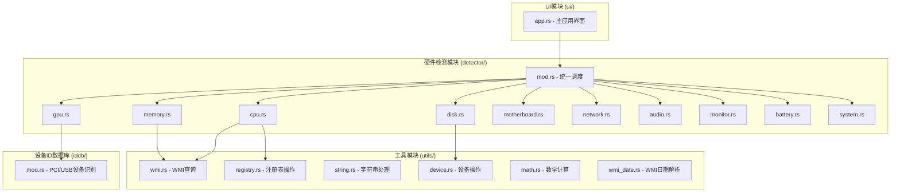
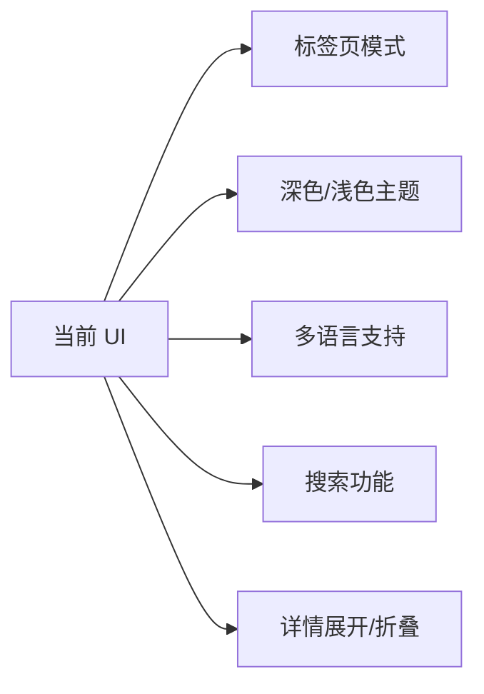

## 📊 项目架构概览




- 顶部区域

检测主机的品牌名字：例如，七彩虹 X15 XS 22 笔记本电脑

- 下方区域

```text
操作系统：Microsoft Windows 10 专业工作站版
处理器：12th Gen Intel(R) Core(TM) i7-12700H
显卡：NVIDIA GeForce RTX 3050 Laptop GPU (4GB 三星 / 蓝天(CLEVO))
内存条：16 GB (Crucial Technology DDR4 3200 8GB x 2)
主板：七彩虹 X15 XS22 (LPC Controller - 5182)
显示器：群创光电. CMN1521（15.5 英寸）
主硬盘：PCle-8 SSD 1TB (1024 GB / 固态硬盘)
无线网卡：英特尔 Wi-Fi 6E AX211 160MHz
电池：Notebook BAT 锂电池 (健康度：100%)
声卡：瑞昱 High Definition Audio @ 英特尔 英特尔@ 智音技术总线
```


---

## 🔧 可优化的地方

### 1. **代码架构层面**

| 问题                     | 说明                                                         | 建议                                              |
| ------------------------ | ------------------------------------------------------------ | ------------------------------------------------- |
| **重复的检测模式**       | 每个 [`detect_*`](src/detector/mod.rs:124) 方法都遵循相同的模式（调用模块函数、返回结果） | 引入宏或 trait 来统一检测逻辑，减少重复代码       |
| **硬编码的中文字体路径** | [`setup_chinese_fonts`](src/ui/app.rs:57) 中硬编码了 Windows 字体路径 | 支持跨平台字体检测，或使用系统字体 API            |
| **错误处理不一致**       | 部分地方使用 `unwrap()`，部分地方返回 `Result`               | 统一错误处理策略，使用 `?` 操作符和自定义错误类型 |
| **Magic Numbers**        | 如进度计算中的 `total`、防抖时间 `1秒`                       | 提取为常量或配置项                                |

### 2. **性能优化**

| 问题                   | 说明                                                         | 建议                                                       |
| ---------------------- | ------------------------------------------------------------ | ---------------------------------------------------------- |
| **串行检测**           | [`detect_all`](src/detector/mod.rs:124) 中所有检测任务串行执行 | 使用 [`rayon`](https://docs.rs/rayon) 并行化独立的检测任务 |
| **WMI 连接重复创建**   | 每个检测模块可能创建独立的 WMI 连接                          | 复用 WMI 连接，使用连接池                                  |
| **设备 ID 数据库加载** | [`LazyLock`](src/iddb/mod.rs:197) 在首次使用时加载大文件     | 考虑增量加载或缓存机制                                     |
| **字符串格式化频繁**   | [`get_hardware_info_text`](src/ui/app.rs:144) 中大量 `format!` | 使用 `String::with_capacity` 预分配                        |

### 3. **代码质量**

| 问题               | 说明                       | 建议                                                         |
| ------------------ | -------------------------- | ------------------------------------------------------------ |
| **缺乏单元测试**   | 仅有少量测试文件           | 为核心模块添加单元测试，特别是 [`utils/`](src/utils/mod.rs) 中的工具函数 |
| **文档注释不完整** | 部分公共函数缺少文档注释   | 使用 `///` 添加完整的文档注释                                |
| **类型转换不安全** | 大量 `unsafe` 代码块       | 封装 unsafe 代码到安全的 wrapper 函数中                      |
| **配置硬编码**     | 窗口大小、进度消息等硬编码 | 使用配置文件或环境变量                                       |

### 4. **UI/UX 优化**

| 问题               | 说明                                              | 建议                                                         |
| ------------------ | ------------------------------------------------- | ------------------------------------------------------------ |
| **窗口大小固定**   | [`max_inner_size`](src/main.rs:33) 固定为 560x360 | 允许用户调整窗口大小，支持响应式布局                         |
| **进度条缺失**     | 只有文字进度，没有可视化进度条                    | 添加 [`ProgressBar`](https://docs.rs/egui/latest/egui/struct.ProgressBar.html) |
| **无深色模式**     | 仅使用默认主题                                    | 添加主题切换功能                                             |
| **复制功能无反馈** | 点击复制按钮没有视觉反馈                          | 添加 Toast 提示                                              |

---

## ♻️ 可复用的地方

### 1. **独立的工具模块**

这些模块可以作为独立的 crate 发布：

| 模块                                         | 功能                   | 复用价值                        |
| -------------------------------------------- | ---------------------- | ------------------------------- |
| [`utils/wmi.rs`](src/utils/wmi.rs)           | 封装 Windows WMI 查询  | ⭐⭐⭐⭐⭐ 任何需要 WMI 的 Rust 项目 |
| [`utils/registry.rs`](src/utils/registry.rs) | 注册表读写操作         | ⭐⭐⭐⭐ Windows 系统工具开发       |
| [`iddb/mod.rs`](src/iddb/mod.rs)             | PCI/USB 设备 ID 数据库 | ⭐⭐⭐⭐⭐ 硬件识别相关项目          |
| [`utils/string.rs`](src/utils/string.rs)     | 字符串转换工具         | ⭐⭐⭐ 通用工具函数                |

### 2. **检测器模式**

```rust
// 可复用的检测器 trait 设计
pub trait HardwareDetector<T> {
    fn detect(&self) -> Result<T, DetectionError>;
    fn name(&self) -> &str;
}

// 可以扩展支持更多硬件类型
// 例如：USB 设备、PCI 设备、传感器等
```

### 3. **进度回调机制**

[`ProgressCallback`](src/detector/mod.rs:30) 的设计模式可以复用到任何需要进度报告的长时间任务中。

### 4. **设备 ID 数据库解析器**

[`load_ids_content`](src/iddb/mod.rs:42) 函数可以解析标准的 `.ids` 格式文件，可用于其他硬件识别项目。

---

## 🚀 可增加的新特性/功能

### 1. **硬件性能测试**

| 功能             | 描述                            | 实现难度 |
| ---------------- | ------------------------------- | -------- |
| **CPU 基准测试** | 运行计算密集型任务测试 CPU 性能 | ⭐⭐⭐      |
| **磁盘读写测试** | 测试磁盘顺序/随机读写速度       | ⭐⭐⭐⭐     |
| **内存带宽测试** | 测试内存读写带宽                | ⭐⭐⭐      |
| **GPU 渲染测试** | 简单的图形渲染性能测试          | ⭐⭐⭐⭐⭐    |

### 2. **实时监控**

| 功能               | 描述                              | 实现难度 |
| ------------------ | --------------------------------- | -------- |
| **CPU 使用率监控** | 实时显示 CPU 各核心使用率         | ⭐⭐       |
| **内存使用监控**   | 实时显示内存占用情况              | ⭐⭐       |
| **温度监控**       | 读取 CPU/GPU 温度（需要传感器库） | ⭐⭐⭐⭐     |
| **网络流量监控**   | 实时显示上传/下载速度             | ⭐⭐⭐      |

### 3. **高级硬件信息**

| 功能                | 描述                          | 实现难度 |
| ------------------- | ----------------------------- | -------- |
| **SMBIOS 详细信息** | 读取完整的 SMBIOS 表          | ⭐⭐⭐      |
| **PCI 设备树**      | 显示完整的 PCI 设备树结构     | ⭐⭐⭐      |
| **USB 设备列表**    | 列出所有 USB 设备及其详细信息 | ⭐⭐⭐      |
| **驱动程序信息**    | 显示各硬件的驱动版本、日期    | ⭐⭐⭐⭐     |
| **BIOS/UEFI 信息**  | 更详细的 BIOS 信息            | ⭐⭐       |

### 4. **导出功能**

| 功能                | 描述                           | 实现难度 |
| ------------------- | ------------------------------ | -------- |
| **导出为 JSON/XML** | 支持将硬件信息导出为结构化格式 | ⭐⭐       |
| **导出为 PDF**      | 生成 PDF 格式的硬件报告        | ⭐⭐⭐⭐     |
| **导出为图片**      | 截图保存当前界面               | ⭐⭐       |
| **生成分享链接**    | 上传到云端生成分享链接         | ⭐⭐⭐⭐⭐    |

### 5. **对比功能**

| 功能             | 描述                       | 实现难度 |
| ---------------- | -------------------------- | -------- |
| **历史记录对比** | 保存多次检测结果并对比差异 | ⭐⭐⭐⭐     |
| **多设备对比**   | 导入其他设备的报告进行对比 | ⭐⭐⭐⭐⭐    |
| **配置推荐**     | 根据硬件配置给出升级建议   | ⭐⭐⭐⭐⭐    |

### 6. **系统优化建议**

| 功能             | 描述                     | 实现难度 |
| ---------------- | ------------------------ | -------- |
| **驱动更新检测** | 检查是否有新的驱动版本   | ⭐⭐⭐⭐⭐    |
| **系统健康评分** | 根据硬件状态给出健康评分 | ⭐⭐⭐      |
| **优化建议**     | 给出系统优化建议         | ⭐⭐⭐⭐     |

### 7. **跨平台支持**

| 功能           | 描述                                | 实现难度 |
| -------------- | ----------------------------------- | -------- |
| **Linux 支持** | 使用 `/proc`、`/sys` 等获取硬件信息 | ⭐⭐⭐⭐⭐    |
| **macOS 支持** | 使用 `system_profiler` 等           | ⭐⭐⭐⭐⭐    |

### 8. **UI 增强**



---

## 📝 总结

### 优先级建议

| 优先级 | 优化/功能     | 理由                   |
| ------ | ------------- | ---------------------- |
| 🔴 高   | 并行化检测    | 显著提升检测速度       |
| 🔴 高   | 添加单元测试  | 提高代码质量和可维护性 |
| 🔴 高   | 导出 JSON/XML | 满足用户数据导出需求   |
| 🟡 中   | 进度条可视化  | 改善用户体验           |
| 🟡 中   | 实时监控功能  | 增加软件实用性         |
| 🟡 中   | 深色模式      | 现代化 UI              |
| 🟢 低   | 跨平台支持    | 扩大用户群但工作量巨大 |
| 🟢 低   | 性能基准测试  | 增加差异化功能         |

